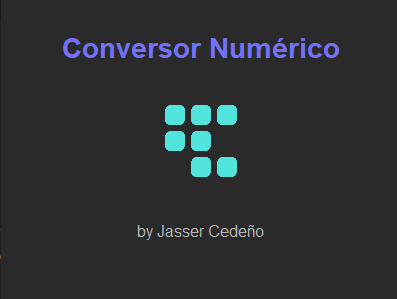
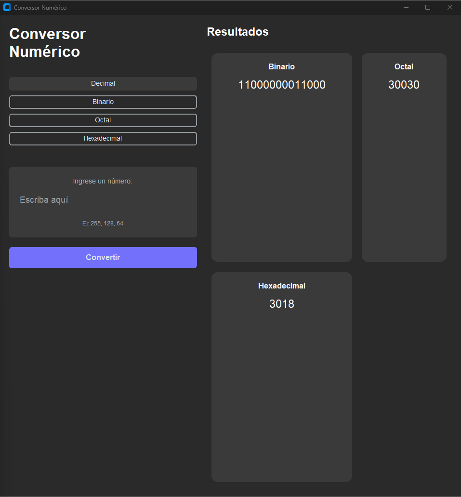

# Conversor de Sistemas Numéricos

Este proyecto es una aplicación que permite convertir números entre diferentes sistemas numéricos (decimal, binario, octal y hexadecimal). Es una herramienta educativa y práctica que facilita la comprensión y manipulación de números en distintas bases.

## Capturas de Pantalla

<div align="center">

### Pantalla de Carga

<p><em>La aplicación muestra una elegante pantalla de carga al iniciar, indicando que el sistema se está preparando.</em></p>

### Ventana Principal

<p><em>Interfaz principal del conversor, donde podrás realizar todas las conversiones entre sistemas numéricos de manera intuitiva.</em></p>

</div>

## Objetivos del Proyecto

- Proporcionar una interfaz intuitiva para la conversión entre sistemas numéricos
- Facilitar el aprendizaje y comprensión de los diferentes sistemas de numeración
- Ofrecer conversiones precisas y en tiempo real
- Implementar validaciones para garantizar entradas correctas
- Mostrar el proceso de conversión paso a paso (cuando sea aplicable)

## Tecnologías Utilizadas

- Python 3.x
- Tkinter (para la interfaz gráfica)
- Pytest (para pruebas unitarias)
- Git (control de versiones)

## Descarga y Uso

### Opción 1: Descargar el Ejecutable (Recomendado para usuarios de Windows)

1. Ve a la sección de [Releases](https://github.com/JC-DEV-EC/conversor_sistemas_numericos/releases) del repositorio
2. Descarga el archivo `conversor_sistemas_numericos.exe` de la última versión
3. Ejecuta el archivo descargado directamente, no requiere instalación

### Opción 2: Instalación desde el Código Fuente

#### Prerrequisitos
- Python 3.x instalado
- Git (opcional, para clonar el repositorio)

### Instalación

1. Clonar el repositorio:
```bash
git clone https://github.com/JC-DEV-EC/conversor_sistemas_numericos.git
```

2. Navegar al directorio del proyecto:
```bash
cd conversor_sistemas_numericos
```

3. Instalar dependencias (si las hay):
```bash
pip install -r requirements.txt
```

### Uso

1. Ejecutar la aplicación:
```bash
python main.py
```

2. En la interfaz:
   - Seleccionar el sistema numérico de origen
   - Ingresar el número a convertir
   - Seleccionar el sistema numérico de destino
   - Hacer clic en "Convertir"

## Funcionalidades

- Conversión entre sistemas:
  - Decimal a Binario, Octal y Hexadecimal
  - Binario a Decimal, Octal y Hexadecimal
  - Octal a Decimal, Binario y Hexadecimal
  - Hexadecimal a Decimal, Binario y Octal
- Validación de entrada en tiempo real
- Interfaz gráfica intuitiva
- Manejo de errores y mensajes informativos

## Contribución

Las contribuciones son bienvenidas. Para contribuir:

1. Fork el proyecto
2. Crea una rama para tu característica (`git checkout -b feature/AmazingFeature`)
3. Commit tus cambios (`git commit -m 'Add some AmazingFeature'`)
4. Push a la rama (`git push origin feature/AmazingFeature`)
5. Abre un Pull Request

## Licencia

Este proyecto está bajo la Licencia MIT - ver el archivo [LICENSE](LICENSE) para más detalles.

## Contacto

Jasser Cedeño - [@JC-DEV-EC](https://github.com/JC-DEV-EC)


